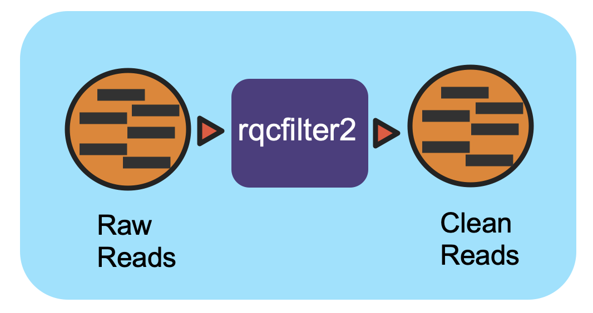

The Reads QC Workflow
=====================

Summary
-------

This workflow is replicate the `QA protocol <https://jgi.doe.gov/data-and-tools/bbtools/bb-tools-user-guide/data-preprocessing/>`_ implemented at JGI for Illumina reads and use the program “rqcfilter2” from BBTools(38:44) which implements them as a pipeline. 

Workflow Diagram
----------------

Workflow Dependencies
---------------------

Third party software
~~~~~~~~~~~~~~~~~~~~

- BBTools:38.44 `(BSD-3-Clause-LBNL) <https://bitbucket.org/berkeleylab/jgi-bbtools/src/master/license.txt>`_

Database 
~~~~~~~~

- RQCFilterData Database `(RQCFilterData.tgz) <https://portal.nersc.gov/cfs/m3408/db/RQCFilterData.tgz>`_ 
    
    It is a 106G tar file includes reference datasets of artifacts, adapters, contaminants, phiX genome, host genomes.  
    
.. code-block:: bash

	mkdir refdata
	wget https://portal.nersc.gov/cfs/m3408/db/RQCFilterData.tgz
	tar -xvzf RQCFilterData.tgz -C refdata
	rm RQCFilterData.tgz
	
Workflow Availability
---------------------

The workflow is available in GitHub:
https://github.com/microbiomedata/ReadsQC

The container is available at Docker Hub (microbiomedata/bbtools):
https://hub.docker.com/r/microbiomedata/bbtools

Test datasets
-------------

Zymobiomics mock-community DNA control `(SRR7877884) <https://www.ebi.ac.uk/ena/browser/view/SRR7877884>`_
`10% subsampling SRR7877884-int-0.1.fastq.gz <https://portal.nersc.gov/cfs/m3408/test_data/SRR7877884-int-0.1.fastq.gz>`_ 

Details
-------

Using rqcfilter2.sh from BBTools performs quality-trimming, artifact removal, linker-trimming, adapter trimming, and spike-in removal(BBDuk) and performs human/cat/dog/mouse/microbe removal (BBMap).

Inputs
~~~~~~

* The input is a json file

.. code-block:: JSON

    {
        "jgi_rqcfilter.database": "/path/to/refdata", 
        "jgi_rqcfilter.input_files": [
            "/path/to/SRR7877884.fastq.gz", 
            "/path/to/Second.fastq.gz", 
        ], 
        "jgi_rqcfilter.outdir": "/path/to/rqcfiltered",
        "jgi_rqcfilter.memory": "35G",
        "jgi_rqcfilter.threads": "16"
    }

* The json file includes three required parts and two optional parameters: 

    1. database path, 

    2. fastq (illumina paired-end interleaved fastq)
    
    3. output path

    4. memory (optional) ex: "jgi_rqcfilter.memory": "35G"

    5. threads (optional) ex: "jgi_rqcfilter.threads": "16"

.. note::
    
    If the input is paired-end fastq file, it should be in interleaved format. Below is command use the SRR7877884 as example to convert the paired-end reads in two files into one interleaved format fastq file.
    
.. code-block:: bash    
    
    paste <(zcat SRR7877884_1.fastq.gz | paste - - - -) <(zcat SRR7877884_2.fastq.gz | paste - - - -) | tr '\t' '\n' | gzip -c > SRR7877884-int.fastq.gz

Outputs
~~~~~~~

The output will have one directory named by prefix of the fastq input file and a bunch of output files, including statistical numbers, status log and a shell script to reproduce the steps etc. 

The main QC fastq output is named by prefix.anqdpht.fast.gz:: 

	|-- SRR7877884.anqdpht.fastq.gz
	|-- filterStats.txt
	|-- filterStats.json
	|-- filterStats2.txt
	|-- adaptersDetected.fa
	|-- reproduce.sh
	|-- spikein.fq.gz
	|-- status.log
	|-- ...

Requirements for Execution
--------------------------

- Docker or other Container Runtime
- Cromwell or other WDL-capable Workflow Execution Tool
- > 40 GB RAM

Running Workflow in Cromwell on Cori
------------------------------------  

Description of the files in `GitHub Repo <https://github.com/microbiomedata/ReadsQC>`_:
 - `.wdl` file: the WDL file for workflow definition
 - `.json` file: the example input for the workflow
 - `.conf` file: the conf file for running Cromwell.
 - `.sh` file: the shell script for running the example workflow
 
Version History
---------------

- 1.0.0

Point of contact
----------------
Original author: Brian Bushnell <bbushnell@lbl.gov>

Package maintainer: Chienchi Lo <chienchi@lanl.gov>

