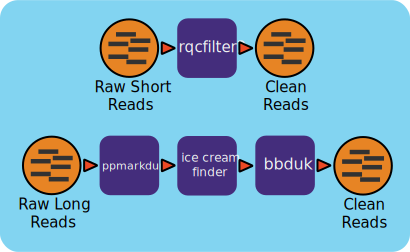

Reads QC Workflow (v1.0.13)
=============================

Workflow Overview
-----------------

**Short Reads:**

This workflow utilizes the program :literal:`rqcfilter2` from BBTools to perform quality control on raw Illumina reads for **shortreads**. The workflow performs quality trimming, artifact removal, linker trimming, adapter trimming, and spike-in removal (using :literal:`BBDuk`), and performs human/cat/dog/mouse/microbe removal (using :literal:`BMap`).

The following parameters are used for :literal:`rqcfilter2` in this workflow::

 - qtrim=r     :  Quality-trim from right ends before mapping.
 - trimq=0     :  Trim quality threshold.
 - maxns=3     :  Reads with more Ns than this will be discarded.
 - maq=3       :  Reads with average quality (before trimming) below this will be discarded.
 - minlen=51   :  Reads shorter than this after trimming will be discarded.  Pairs will be discarded only if both are shorter.
 - mlf=0.33    :  Reads shorter than this fraction of original length after trimming will be discarded.
 - phix=true   :  Remove reads containing phiX kmers.
 - khist=true  :  Generate a kmer-frequency histogram of the output data.
 - kapa=true   :  Remove and quantify kapa tag
 - trimpolyg=5 :  Trim reads that start or end with a G polymer at least this long
 - clumpify=true       :  Run clumpify; all deduplication flags require this.
 - removehuman=true    :  Remove human reads via mapping.
 - removedog=true      :  Remove dog reads via mapping.
 - removecat=true      :  Remove cat reads via mapping.
 - removemouse=true    :  Remove mouse reads via mapping.
 - barcodefilter=false :  Disable improper barcodes filter
 - chastityfilter=false:  Remove illumina reads failing chastity filter.
 - trimfragadapter=true:  Trim all known Illumina adapter sequences, including TruSeq and Nextera.
 - removemicrobes=true :  Remove common contaminant microbial reads via mapping, and place them in a separate file.

**Long Reads:**

This workflow performs quality control on long reads from PacBio. The workflow performs duplicate removal (using :literal:`pbmarkdup`), inverted repeat filtering (using BBTools 
:literal:`icecreamfinder.sh`), adapter trimming, and final filtering of reads with residual adapter sequences (using :literal:`bbduk`). The workflow is designed to handle input files in various formats, including .bam, .fq, or .fq.gz.

The following parameters are used for each stage in the workflow::

- rmdup=true    : Enables duplicate removal in the initial filtering.
- k=20, mink=12 : K-mer sizes for adapter detection and trimming.
- edist=1       : Error distance for k-mer matches.
- ktrimtips=60  : Trims adapters from the ends of reads.
- phix=true     : Removes reads containing PhiX sequences.
- json=true     : Outputs statistics in JSON format for easier parsing.
- chastityfilter=true : Removes reads failing the chastity filter.
- removehuman=true    : Removes human reads in contamination analysis (optional).
- removemicrobes=true : Removes common microbial contaminants.

 
Workflow Availability
---------------------

The workflow from GitHub uses all the listed docker images to run all third-party tools.

The workflow is available in GitHub: https://github.com/microbiomedata/ReadsQC

The Docker image is available in DockerHub: https://hub.docker.com/r/microbiomedata/bbtools.

Requirements for Execution 
--------------------------

(recommendations are in **bold**) 

- WDL-capable Workflow Execution Tool (**Cromwell**)
- Container Runtime that can load Docker images (**Docker v2.1.0.3 or higher**) 

Hardware Requirements
---------------------

- Disk space: 106 GB for the RQCFilterData database 
- Memory: >40 GB RAM

Workflow Dependencies
---------------------

Third party software (This is included in the Docker image.)  
~~~~~~~~~~~~~~~~~~~~~~~~~~~~~~~~~~~~~~~~~~~~~~~~~~~~~~~~~~~~

- `BBTools v38.96 <https://jgi.doe.gov/data-and-tools/bbtools/>`_ (License: `BSD-3-Clause-LBNL <https://bitbucket.org/berkeleylab/jgi-bbtools/src/master/license.txt>`_)

Requisite database
~~~~~~~~~~~~~~~~~~

The RQCFilterData Database must be downloaded and installed. This is a 106 GB tar file which includes reference datasets of artifacts, adapters, contaminants, the phiX genome, and some host genomes.  

The following commands will download the database:: 

    mkdir refdata
    wget http://portal.nersc.gov/dna/microbial/assembly/bushnell/RQCFilterData.tar
    tar -xvf RQCFilterData.tar -C refdata
    rm RQCFilterData.tar	

Sample dataset(s)
-----------------
**Short Reads:**

- small dataset: `Ecoli 10x <https://portal.nersc.gov/cfs/m3408/test_data/ReadsQC_small_test_data.tgz>`_ . (Input/output included in tar.gz file).

- Zymobiomics mock-community DNA control (`SRR7877884 <https://www.ncbi.nlm.nih.gov/sra/SRX4716743>`_); this `dataset <https://portal.nersc.gov/cfs/m3408/test_data/SRR7877884/>`_ is has 6.7G bases.

  - The non-interleaved raw fastq files are available as `R1 <https://portal.nersc.gov/cfs/m3408/test_data/SRR7877884/SRR7877884_1.fastq.gz>`_ and `R2 <https://portal.nersc.gov/cfs/m3408/test_data/SRR7877884/SRR7877884_2.fastq.gz>`_
  - The interleaved raw fastq file is available `here <https://portal.nersc.gov/cfs/m3408/test_data/SRR7877884/SRR7877884-int.fastq.gz>`_
  - A 10% subset of the interleaved fastq is available `here <https://portal.nersc.gov/cfs/m3408/test_data/SRR7877884/SRR7877884-int-0.1.fastq.gz>`_

.. note::

    If the input data is paired-end data, it must be in interleaved format. The following command will interleave the files, using the above dataset as an example:
    
.. code-block:: bash    

    paste <(zcat SRR7877884_1.fastq.gz | paste - - - -) <(zcat SRR7877884_2.fastq.gz | paste - - - -) | tr '\t' '\n' | gzip -c > SRR7877884-int.fastq.gz

**Long Reads:**

Zymobiomics synthetic metagenome (`SRR13128014 <https://portal.nersc.gov/cfs/m3408/test_data/SRR13128014.pacbio.subsample.ccs.fastq.gz>`_) For testing we have subsampled the dataset, the original dataset is ~18GB.

Input
------

A `JSON file <https://github.com/microbiomedata/ReadsQC/blob/documentation/input.json>`_ containing the following information: 

1. the path to the interleaved fastq file (longreads and shortreads) 
2. forwards reads fastq file (when input_interleaved is false)
3. reverse reads fastq file (when input_interleaved is false)  
4. project id
5. if the input is interleaved (boolean) 
6. if the input is shortreads (boolean)

An example input JSON file is shown below:
**Short Reads, Interleaved**

.. code-block:: JSON

    {
	"rqcfilter.input_files": ["https://portal.nersc.gov/cfs/m3408/test_data/smalltest.int.fastq.gz"],
    	"rqcfilter.input_fq1": [],
    	"rqcfilter.input_fq2": [],
    	"rqcfilter.proj": "nmdc:xxxxxxx",
   	"rqcfilter.interleaved": true,
    	"rqcfilter.shortRead": true
    }

.. note::

    In an HPC environment, parallel processing allows for processing multiple samples, both interleaved and noninterleaved for **shortreads**. The "rqcfilter.input_files" parameter is an array data structure. It can be used for multiple samples as input separated by a comma (,).
    
    Example: 
	**Interleaved**: :literal:`"rqcfilter.input_files": ["first-int.fastq","second-int.fastq"]`

	**Non-Interleaved**: :literal:`"rqcfilter.input_fq1": ["first-int-R1.fastq","second-int-R1.fastq"], "rqcfilter.input_fq2": ["first-int-R2.fastq","second-int-R2.fastq"]`

Output
------

The output directory will contain the following files for short reads::

    output/
    ├── nmdc_xxxxxxx_filtered.fastq.gz
    ├── nmdc_xxxxxxx_filterStats.txt
    ├── nmdc_xxxxxxx_filterStats2.txt
    ├── nmdc_xxxxxxx_readsQC.info
    └── nmdc_xxxxxxx_qa_stats.json

The output directory will contain the following files for long reads::

    output/
    ├── nmdc_xxxxxxx_pbmarkdupStats.txt
    ├── nmdc_xxxxxxx_readsQC.info
    ├── nmdc_xxxxxxx_bbdukEndsStats.json
    ├── nmdc_xxxxxxx_icecreamStats.json
    ├── nmdc_xxxxxxx_filtered.fastq.gz
    └── nmdc_xxxxxxx_stats.json

An example output txt file (:literal:`filterStats.txt`) for short reads is shown below:
   
.. code-block:: text 
    
	inputReads=250000
	inputBases=37109226
	qtrimmedReads=0
	qtrimmedBases=0
	qfilteredReads=208
	qfilteredBases=10798
	ktrimmedReads=456
	ktrimmedBases=7726
	kfilteredReads=0
	kfilteredBases=0
	outputReads=249398
	outputBases=37003919
	gcPolymerRatio=0.165888

Below is an example of all the output directory files with descriptions to the right.

==================================== ============================================================================
FileName                              Description
==================================== ============================================================================
**Short Reads**
nmdc_xxxxxxx_filtered.fastq.gz        main output (clean data)
nmdc_xxxxxxx_filterStats.txt	      summary statistics 
nmdc_xxxxxxx_filterStats2.txt	      more detailed summary statistics
nmdc_xxxxxxx_readsQC.info	      summary of parameters used in :literal:`BBTools rqcfilter2`
nmdc_xxxxxxx_qa_stats.json	      summary statistics of output bases, input reads, input bases, output reads
**Long Reads**
nmdc_xxxxxxx_filtered.fastq.gz        main output (clean data)
nmdc_xxxxxxx_pbmarkdupStats.txt       statistics from the :literal:`pbmarkdup` duplicate removal
nmdc_xxxxxxx_readsQC.info             summary of parameters and tools used in QC
nmdc_xxxxxxx_bbdukEndsStats.json      :literal:`JSON` statistics from :literal:`bbduk` adapter trimming on ends
nmdc_xxxxxxx_icecreamStats.json       :literal:`JSON` statistics from inverted repeat filtering
nmdc_xxxxxxx_stats.json               summary statistics of output bases, input reads, input bases, output reads
==================================== ============================================================================

Version History
---------------

- 1.0.13 (release date **11/07/2024**; previous versions: 1.0.12)

Point of contact
----------------

- Original author: Brian Bushnell <bbushnell@lbl.gov>

- Package maintainer: Chienchi Lo <chienchi@lanl.gov>

